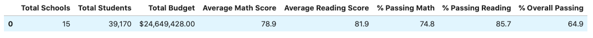

# School_District_Analysis
## Overview of the School District Analysis
Maria, the chief data scientist for a city school district is asking us to help analyze data on student fundsing and students' standardized test scores. We helped aggregate the data and showcased trends in school performance to assist the schoolboard and superintendent make decisons on the schools' budgets and priorities. After providing the schoolboard with our findings, we were notified about evidence of academic dishonesty; specifically reading and math grades for Thomas High school 9th graders. We have removed the reading and math sccores for Thomas High 9th graders while leaving the rest of the data intact. Here is our findings on the udpated analysis.

## Results
- District Summary

 After nullifying the math and reading scores for Thomas High 9th graders, there was less than a 1% drop on the overall passing rate for the school district.The change is insignificant on a district level and should not influence any decisions

District Summary including Thomas High 9th grade math and reading scores
![beforepic]

District Summary excluding Thomas High 9th grade math and reading scores

- School Summary

## Summary
